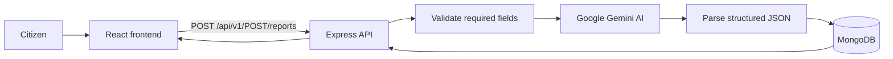

 # CrisisDesk AI

## Overview

CrisisDesk AI is an emergency and public-service request triage application. A citizen submits a short report containing their name, contact number, location, and a description of what happened. The backend sends the description to Google Gemini, converts the response into structured triage data, and stores the complete report in MongoDB. The React frontend then displays the newly created report and its AI analysis.

The project currently provides:

- A React and Vite form for submitting citizen reports.
- Bengali/English/unknown language detection through the AI response contract.
- AI categorization into medical, fire, accident, crime, flood, utility, public service, infrastructure, or other.
- AI urgency classification as low, medium, high, or critical.
- An English summary, suggested responder action, and confidence score.
- MongoDB persistence through Mongoose.
- Read and delete report API endpoints.
- Basic API hardening with Helmet-compatible project dependencies, CORS, request logging, rate limiting, and request slow-down middleware. The current application registers CORS, Morgan, rate limiting, and slow-down middleware; Helmet is installed but not currently registered.

## How It Works



1. The user enters their details and a 10–20 word incident description in the frontend.
2. The frontend validates the form, including a Bangladesh mobile-number format.
3. The frontend sends the report to the backend with Axios.
4. The backend validates required fields and submits the description to Gemini.
5. Gemini is instructed to return JSON containing language, category, urgency, summary, suggested action, and confidence.
6. The backend stores the original fields and AI-generated fields in MongoDB.
7. The created report is returned to the frontend and displayed in the Reports panel.

## Technology Stack

### Frontend

- React 19
- TypeScript
- Vite
- Axios
- Tailwind CSS 4 with the Vite plugin

### Backend

- Node.js 20-compatible runtime
- Express 5
- TypeScript
- Mongoose and MongoDB
- Google GenAI SDK
- `express-rate-limit` and `express-slow-down`
- Morgan request logging
- CORS and dotenv

## Repository Structure

```text
.
├── backend/
│   ├── src/
│   │   ├── controllers/       HTTP handlers for health and reports
│   │   ├── middlewares/       Rate limiting and request slow-down
│   │   ├── models/            Mongoose report schema
│   │   ├── routes/             Versioned API routes
│   │   ├── services/           MongoDB connection service
│   │   ├── utils/              AI client, API responses, and async handling
│   │   ├── index.ts            Express application configuration
│   │   └── server.ts           HTTP server entry point
│   ├── Dockerfile
│   ├── package.json
│   └── tsconfig.json
├── frontend/
│   ├── src/
│   │   ├── axios/              Axios API client
│   │   ├── App.tsx             Form and report display
│   │   ├── App.css
│   │   └── main.tsx            React entry point
│   ├── package.json
│   └── vite.config.ts
├── docker-compose.yml
└── readme.md
```

## Prerequisites

- Node.js 20 or later
- npm
- A MongoDB deployment or local MongoDB instance
- A Google Gemini API key supported by the `@google/genai` SDK

## Environment Configuration

Create `backend/.env` locally. Do not commit this file or share its values:

```env
PORT=3000
MONGO_URI=mongodb://127.0.0.1:27017/reports
GEMINI_API_KEY=your_gemini_api_key
```

The backend reads:

| Variable | Required | Description |
| --- | --- | --- |
| `PORT` | No | HTTP port. Defaults to `3000`. |
| `MONGO_URI` | Yes | MongoDB connection string used by Mongoose. |
| `GEMINI_API_KEY` | Yes | API key used to initialize Google GenAI. |

The repository currently contains a backend environment file with credential-shaped values. Those credentials should be revoked and rotated immediately if they are real, and the file should be kept out of version control.

## Running Locally

Install dependencies in each application:

```bash
cd backend
npm install

cd ../frontend
npm install
```

Start the backend in development mode:

```bash
cd backend
npm run dev
```

The API listens on `http://localhost:3000` by default.

Start the frontend in a second terminal:

```bash
cd frontend
npm run dev
```

Vite normally serves the frontend at `http://localhost:5173`. The frontend Axios client currently calls `http://localhost:3000/api/v1`, so the backend must be running separately.

## Production Builds

Build and start the backend:

```bash
cd backend
npm run build
npm start
```

Build the frontend:

```bash
cd frontend
npm run build
npm run preview
```

Available package scripts:

| Directory | Command | Purpose |
| --- | --- | --- |
| `backend` | `npm run dev` | Run TypeScript directly with Nodemon. |
| `backend` | `npm run build` | Compile TypeScript to `backend/dist`. |
| `backend` | `npm start` | Run the compiled server from `dist/server.js`. |
| `backend` | `npm run lint` | Lint backend TypeScript files. |
| `frontend` | `npm run dev` | Start the Vite development server. |
| `frontend` | `npm run build` | Type-check and create a Vite production build. |
| `frontend` | `npm run lint` | Lint frontend files. |
| `frontend` | `npm run preview` | Preview the production frontend build. |

## API Reference

All report routes are mounted below `/api/v1`.

### Health check

```http
GET /api/v1/health
```

Returns an `ApiResponse` with HTTP `200` and the message `Okk`.

### Create a report

```http
POST /api/v1/POST/reports
Content-Type: application/json
```

Request body:

```json
{
	"name": "Amina Rahman",
	"contact": "01712345678",
	"location": "Dhanmondi, Dhaka",
	"description": "A motorcycle accident has blocked the road and one person needs urgent medical attention"
}
```

The four fields are required. The backend rejects missing or blank values with HTTP `400`. The frontend additionally requires a Bangladesh mobile number and a description between 10 and 20 words.

On success, the backend returns HTTP `201` with the created MongoDB document in `data`:

```json
{
	"statusCode": 201,
	"data": {
		"_id": "...",
		"name": "amina rahman",
		"contact": "01712345678",
		"location": "Dhanmondi, Dhaka",
		"description": "A motorcycle accident has blocked the road and one person needs urgent medical attention",
		"language": "en",
		"category": "accident",
		"urgency": "high",
		"summary": "A motorcycle accident is blocking a road and requires medical assistance.",
		"suggestedAction": "Dispatch medical responders and clear the blocked road.",
		"confidence": 0.92,
		"possibleDuplicate": false,
		"matchedReportId": null,
		"status": "pending",
		"createdAt": "...",
		"updatedAt": "..."
	},
	"message": "Report Created Successfully",
	"success": true
}
```

The AI request is limited to 15 submissions per IP address every 10 minutes. The global limiter allows 100 requests per IP every 15 minutes, and requests after the sixth hit in that window are progressively slowed down.

### List reports

```http
GET /api/v1/GET/reports
```

Returns all reports from MongoDB. The current implementation responds with HTTP `201` and an `ApiResponse` whose `data` value is an array of reports.

### Get one report

```http
GET /api/v1/GET/reports/:id
```

Returns one report by MongoDB document ID. A missing or unknown ID currently produces HTTP `400`; a successful lookup returns HTTP `201`.

### Delete one report

```http
DELETE /api/v1/DELETE/reports/:id
```

Deletes and returns one report by MongoDB document ID. A missing or unknown ID currently produces HTTP `400`; a successful deletion returns HTTP `201`.

## Report Data Model

Reports contain the submitted fields plus AI and workflow metadata:

| Field | Type | Notes |
| --- | --- | --- |
| `name` | String | Required and trimmed; lowercased during creation. |
| `contact` | String | Required and trimmed. |
| `location` | String | Required and trimmed. |
| `description` | String | Required and trimmed. |
| `language` | String | `bn`, `en`, or `unknown`; defaults to `en`. |
| `category` | String | One of the supported emergency/service categories. |
| `urgency` | String | `low`, `medium`, `high`, or `critical`. |
| `summary` | String | AI-generated English summary. |
| `suggestedAction` | String | Recommended responder action. |
| `confidence` | Number | Between `0` and `1`. |
| `possibleDuplicate` | Boolean | Defaults to `false`. |
| `matchedReportId` | String or null | Reserved for duplicate matching. |
| `status` | String | `pending`, `in_review`, `assigned`, `resolved`, or `rejected`; defaults to `pending`. |
| `createdAt` / `updatedAt` | Date | Added automatically by Mongoose timestamps. |

## Docker

The repository includes a backend Dockerfile and a `docker-compose.yml` that expects services on ports `3000` and `5173`. The backend image installs dependencies, compiles TypeScript, and starts the compiled server.

At present, the Compose file references `frontend/Dockerfile`, but that file is not present in the repository. Therefore, `docker compose up --build` will not start successfully until a frontend Dockerfile is added or the frontend service is changed to use an existing image/build strategy. The Compose configuration also passes `GEMINI_API_KEY` and `MONGO_URI` from the host environment.

## Current Limitations and Next Steps

- The frontend keeps reports only in local React state after submission; it does not call the list, get, or delete endpoints on page load.
- There is no authentication or authorization for reading and deleting reports.
- AI output is parsed as JSON without schema validation, so malformed model output becomes a server error.
- The backend catches report creation failures and returns a generic HTTP `500` response.
- The schema defines duplicate and status fields, but no duplicate detection or status-management endpoints are implemented yet.
- `helmet` is installed but should be registered in the Express app before deployment.
- The API URL is hard-coded in the frontend Axios client and should be moved to a Vite environment variable for deployment.
- The API uses action words in route paths such as `/POST/reports`; conventional REST paths such as `/reports` could be introduced in a future version while preserving backwards compatibility.
- No automated test suite is currently included.

## Security Notes

- Never commit `backend/.env` or expose MongoDB and Gemini credentials in source control.
- Rotate any credentials that have already been exposed.
- Add authentication and authorization before exposing report reads or deletes publicly.
- Validate and constrain AI output before persisting or displaying it.
- Configure a production-specific CORS allowlist instead of permitting every origin.
- Use HTTPS in deployed environments because reports contain contact and location data.
